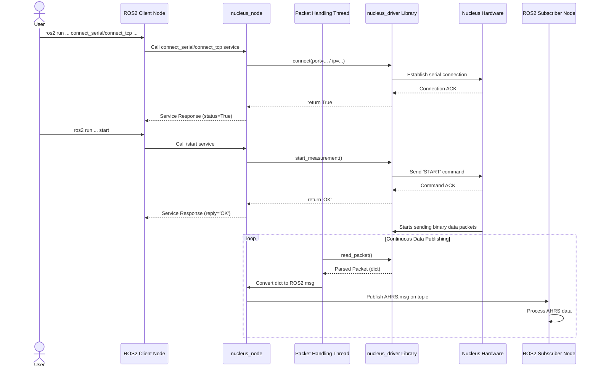

# ROS2 Wrapper for the Nucleus Driver

## 1. Summary

The `nucleus_driver_ros2` package serves as a comprehensive ROS2 wrapper for the `nucleus_driver`, a Python library designed to interface with Nortek Nucleus instruments (DVLs, IMUs, etc.). This wrapper exposes the functionality of the driver to the ROS2 ecosystem, allowing for seamless integration of Nucleus sensor data and control into larger robotics systems.

The core of the package is the `nucleus_node`, which handles the direct communication with the Nucleus device. It provides a set of ROS2 **Services** for configuration and control (e.g., connecting, starting/stopping measurements, sending commands) and publishes the instrument's data output through a series of ROS2 **Topics**.

This architecture decouples device communication from data consumption, enabling multiple ROS2 nodes to subscribe to the sensor data streams they need while providing a centralized point of control for the physical instrument.

Key functionalities include:
- Establishing a connection to the Nucleus device via Serial or TCP.
- Starting and stopping data measurement and field calibration.
- Sending arbitrary commands to the device.
- Parsing incoming data packets from the device.
- Publishing parsed data on distinctly typed ROS2 topics (e.g., for AHRS, Bottom Track, Altimeter data).
- Providing simple client and subscriber nodes for easy command-line interaction and as examples for integration.

---

## 2. Detailed Sections

### 2.1. `nucleus_node`: The Core Component

The `nucleus_node` is the central server node that bridges the Nucleus instrument and the ROS2 environment.

- **Instantiation**: It creates an instance of the `NucleusDriver` class from the underlying Python library. This object manages the low-level communication (Serial/TCP), packet parsing, and command formatting.
- **Service Servers**: The node creates several ROS2 service servers that map directly to the control functions of the `NucleusDriver`, such as `connect`, `disconnect`, `start`, `stop`, and `send_command`.
- **Publishers**: For each type of data packet the Nucleus can produce (AHRS, INS, BottomTrack, etc.), the node creates a corresponding ROS2 publisher.
- **Asynchronous Packet Handling**: To ensure the ROS2 node remains responsive, packet reading and processing are handled in a separate thread (`packet_handling`). This thread continuously polls the `NucleusDriver` for new data packets. When a packet is received, it is:
    1.  Parsed by the `nucleus_driver` library into a Python dictionary.
    2.  Converted from the dictionary format into a custom ROS2 message type (defined in the `interfaces` package).
    3.  Published on the appropriate ROS2 topic.

This multi-threaded design is crucial as it prevents the blocking I/O operation of reading from the device from stalling the main ROS2 event loop (spin).

### 2.2. ROS2 Services (Control Plane)

Services provide a request/response mechanism for controlling the `nucleus_node`. Another ROS2 node (a client) can call a service and wait for a reply, making them ideal for synchronous operations like device configuration.

| Service Name                       | Service Type (`interfaces/srv`) | Description                                                                 |
| ---------------------------------- | ------------------------------- | --------------------------------------------------------------------------- |
| `/nucleus_node/connect_serial`     | `ConnectSerial`                 | Establishes a serial connection to the Nucleus device.                      |
| `/nucleus_node/connect_tcp`        | `ConnectTcp`                    | Establishes a TCP connection to the Nucleus device.                         |
| `/nucleus_node/disconnect`         | `Disconnect`                    | Terminates the current connection.                                          |
| `/nucleus_node/start`              | `Start`                         | Sends the command to start data measurement.                                |
| `/nucleus_node/field_calibration`  | `StartFieldCalibration`         | Sends the command to start the field calibration routine.                   |
| `/nucleus_node/stop`               | `Stop`                          | Sends the command to stop measurement/calibration.                          |
| `/nucleus_node/command`            | `Command`                       | Sends a raw command string to the device and returns its reply.             |

### 2.3. ROS2 Topics (Data Plane)

Topics use a publish/subscribe model for streaming data. The `nucleus_node` publishes data packets as they are received from the instrument, and any number of other nodes can subscribe to these topics to consume the data asynchronously. These topics use custom message types that are a direct one-to-one mapping of the instrument's binary data packets.

| Topic Name                            | Message Type (`interfaces/msg`) | Description                                                               |
| ------------------------------------- | ------------------------------- | ------------------------------------------------------------------------- |
| `/nucleus_node/ahrs_packets`          | `AHRS`                          | Attitude and Heading Reference System data (roll, pitch, heading, etc.).  |
| `/nucleus_node/ins_packets`           | `INS`                           | Inertial Navigation System data (position, velocity, etc.).               |
| `/nucleus_node/altimeter_packets`     | `Altimeter`                     | Altimeter data (distance to bottom, quality, etc.).                       |
| `/nucleus_node/bottom_track_packets`  | `BottomTrack`                   | DVL bottom track data (velocity relative to the seabed).                  |
| `/nucleus_node/water_track_packets`   | `WaterTrack`                    | DVL water track data (velocity relative to the water column).             |
| `/nucleus_node/current_profile_packets`| `CurrentProfile`               | Water current profile data across multiple cells.                         |
| `/nucleus_node/field_calibration_packets`| `FieldCalibration`          | Data packets generated during the field calibration process.              |
| `/nucleus_node/imu_packets`           | `IMU`                           | Raw Inertial Measurement Unit data (accelerations, angular rates).        |
| `/nucleus_node/magnetometer_packets`  | `Magnetometer`                  | Raw magnetometer data.                                                    |

### 2.3.1. Standard ROS2 Topics (Data Plane)

For easier integration with standard ROS2 tools and packages (e.g., `robot_localization`, RViz, etc.), the `nucleus_node` also translates the proprietary packet data into messages of standard types, published on parallel "common" topics. This avoids the need for downstream nodes to parse the custom `interfaces/msg` types if they only need common sensor data.

All stamped messages use the `frame_id` specified in the `frame_id` node parameter (default: `nucleus_link`).

| Topic Name                               | Message Type (`sensor_msgs`, etc.) | Description & Source Packet(s)                                                                                                    |
| ---------------------------------------- | ---------------------------------- | --------------------------------------------------------------------------------------------------------------------------------- |
| `/nucleus_node/altitude_common`          | `geometry_msgs/PointStamped`                 | Altitude/distance from the altimeter, in meters. Sourced from the `Altimeter` packet.                                             |
| `/nucleus_node/sound_speed_common`          | `geometry_msgs/PointStamped`                 | Sound speed, in meters. Sourced from the `Altimeter` packet.                                             |
| `/nucleus_node/bottom_lock_velocity_common` | `geometry_msgs/TwistWithCovariance`    | Velocity relative to the seabed (bottom lock). Sourced from the `BottomTrack` packet.                                             |
| `/nucleus_node/water_track_velocity_common` | `geometry_msgs/TwistWithCovariance`    | Velocity relative to the water. Sourced from the `WaterTrack` packet.                                                             |
| `/nucleus_node/imu_common`               | `sensor_msgs/Imu`                  | IMU data. This topic may receive partial messages. Orientation is published from `AHRS` packets. Angular velocity and linear acceleration are published from `IMU` packets. Covariance fields indicate which data is present. |
| `/nucleus_node/magnetic_common`          | `sensor_msgs/MagneticField`        | 3-axis magnetometer readings in Tesla. Sourced from the `Magnetometer` packet.                                                    |
| `/nucleus_node/pressure_common`          | `sensor_msgs/FluidPressure`        | Ambient fluid pressure in Pascals. Sourced from `Altimeter` and `BottomTrack` packets.                                            |
| `/nucleus_node/temperature_common`       | `sensor_msgs/Temperature`          | Ambient temperature in Celsius. Sourced from `Altimeter` and `BottomTrack` packets.                                               |

### 2.4. Client and Subscriber Nodes

To simplify usage and provide clear examples, the package includes pre-built client and subscriber nodes that are installed as executables.

- **Clients (`nucleus_clients/`)**: Each service has a corresponding command-line client. For example, `ros2 run nucleus_driver_ros2 connect_serial /dev/ttyUSB0` executes a simple client that calls the `/nucleus_node/connect_serial` service. These clients can also be imported as Python classes into your own nodes, as demonstrated in `examples/example.py`.

- **Subscribers (`nucleus_subscribers/`)**: Similarly, each topic has a subscriber that can be run from the command line (e.g., `ros2 run nucleus_driver_ros2 ahrs_packets`). These subscribers listen to their respective topics and print a summary of the received messages to the console, serving as a quick diagnostic tool and an implementation reference.

### 2.5. Custom Interfaces (`interfaces` package)

All custom data structures for services and topics are defined in the `interfaces` package.
- **Messages (`.msg`)**: The fields in each `.msg` file (e.g., `AHRS.msg`) are a direct mapping of the data fields parsed by the `nucleus_driver`. This ensures all information from the instrument is available in the ROS2 environment.
- **Services (`.srv`)**: These files define the request and response structure for each service. For example, `ConnectSerial.srv` defines a `serial_port` string in the request and a `status` boolean in the response.

---

## 3. Diagrams

### 3.1. System Architecture and Pipeline

This diagram illustrates the high-level architecture, showing how the different components interact within the ROS2 ecosystem.

```mermaid
graph TD
    subgraph ROS2 Ecosystem
        subgraph "User Application / Other ROS2 Nodes"
            A["ROS2 Client Node<br>(e.g., custom_control_node)"] -- Service Call --> S;
            B["ROS2 Subscriber Node<br>(e.g., navigation_filter)"] -- Subscribes to --> T;
        end

        subgraph "nucleus_driver_ros2 Package"
            S(ROS2 Services<br>/nucleus_node/connect_*<br>/nucleus_node/start<br>...)
            T(ROS2 Topics<br>/nucleus_node/ahrs_packets<br>/nucleus_node/bottom_track_packets<br>...)
            
            subgraph "nucleus_node"
                direction LR
                ServiceServers[Service Servers] -- Calls --> Driver;
                PacketThread[Packet Handling Thread] <-- Reads from -- Driver;
                Driver(nucleus_driver<br>Python Library);
                PacketThread -- Publishes to --> Publishers[ROS2 Publishers];
            end
            
            S -- Handled by --> ServiceServers;
            Publishers -- Data --> T;
        end
    end
    
    Driver -- "Serial or TCP<br>Commands & Data" --> Device;
    Device[("Nortek Nucleus<br>Hardware")] -- Binary Packets --> Driver;

    style S fill:#cde4ff,stroke:#6699ff
    style T fill:#cdffc9,stroke:#66cc66
    style A fill:#fff2cd,stroke:#ffcc66
    style B fill:#fff2cd,stroke:#ffcc66
```

### 3.2. Dataflow Diagram (Measurement Scenario)

This diagram shows the step-by-step flow of data from a user's command to the reception of sensor data in another ROS2 node.


